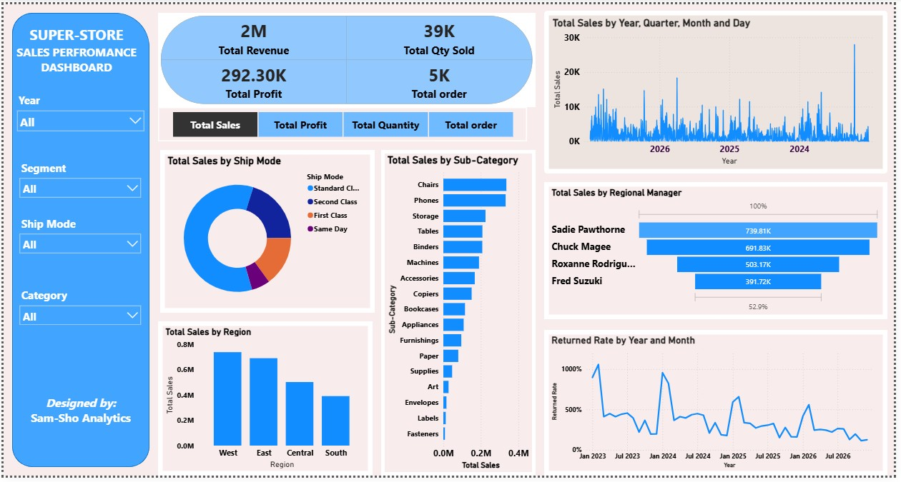
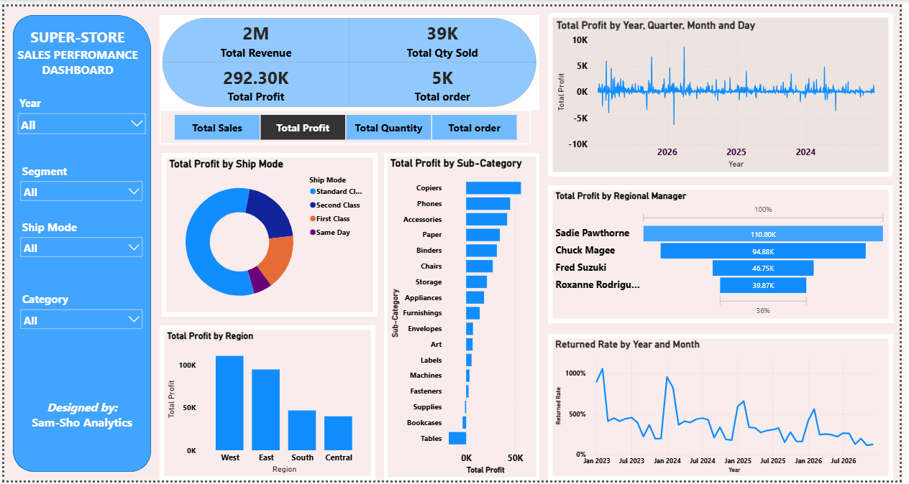
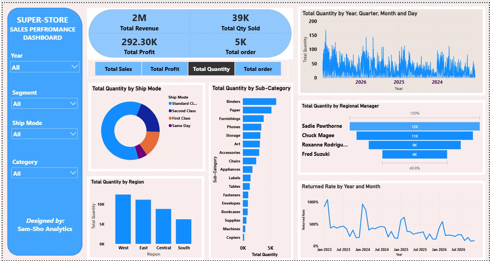
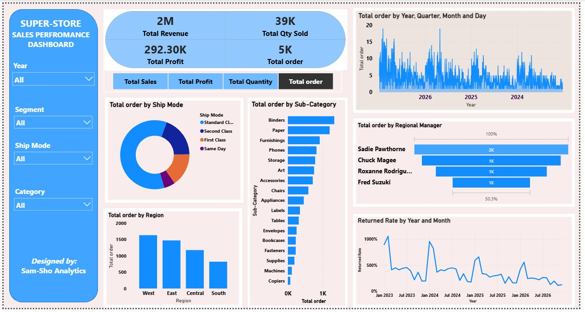
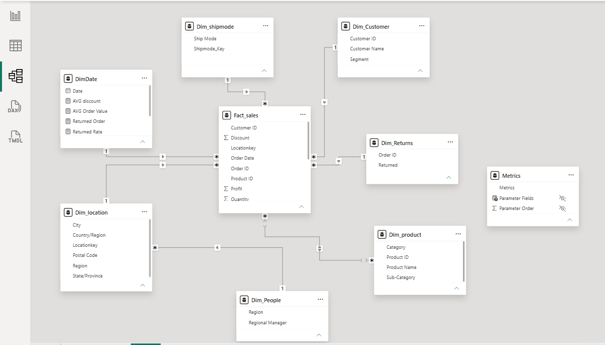

# SAMLOGIC Ecommerce-sales-performance-analytics
Interactive Power BI dashboard analyzing e-commerce sales performance using data modeling, DAX, and KPI reporting to support data-driven business decisions.

## Dashboard Preview

### Sales Performances across Categories( such as by Regions/Regional managers,by products/Sub catergories, by time periods.

### Profit Analysis across Categories

### Product Performance 

### Total Order across various Categories

# Project Overview

This project is an interactive Business Intelligence dashboard designed to analyze the sales performance of an e-commerce business. It transforms raw transactional data into meaningful insights that help management monitor revenue, profitability, customer behavior, and product performance for data-driven decision-making.

# Business Problem

E-commerce businesses generate thousands of sales transactions across multiple products, regions, customer segments, and sales channels.

Without effective analytics, it can be difficult to:

- Identify high-performing products
- Monitor profitability
- Understand customer purchasing patterns
- Evaluate regional performance
- Identify growth opportunities
- Make data-driven business decisions

# Solution

Developed an interactive Power BI dashboard that consolidates sales data into a centralized reporting solution, enabling stakeholders to monitor key performance indicators (KPIs), analyze trends, and identify growth opportunities through dynamic visualizations and drill-through analysis.

# Key Features
Executive KPI dashboard
Sales trend analysis
Revenue and profit analysis
Top-performing products
Category performance
Regional sales analysis
Customer segment analysis
Monthly and yearly comparisons
Interactive filters and slicers
Drill-down capabilities for detailed analysis
Key Metrics
Total Sales
Total Profit
Total Orders
Profit Margin
Average Order Value
Quantity Sold
Customer Count
Top Products
Top Categories
Regional Performance
Business Insights

# The dashboard enables business users to:

Identify best-selling and underperforming products.
Monitor sales and profitability trends over time.
Evaluate regional sales performance.
Analyze customer purchasing behavior.
Compare category performance.
Support pricing, inventory, and marketing decisions using real-time insights.

# 🏗️ Data Modeling

The dataset was transformed into a star schema to improve data organization, analytical performance, and report usability.

Fact Table

FactSales

Contains transactional measures such as:

Sales
Quantity
Discount
Profit

and transactional identifiers including:

Order ID
Customer ID
Product ID
Order Date
Ship Date
Location Key
Dimension Tables

DimDate

Date
Year
Quarter
Month
Week
Day

DimCustomer

Customer ID
Customer Name
Segment

DimProduct

Product ID
Product Name
Category
Sub-Category

DimLocation

Location Key
Country/Region
Region
State/Province
City
Postal Code

DimShipMode

Ship Mode

DimRegionManager

Region
Regional Manager
Returns

FactReturns

Order ID
Return Status
## Data model

## Tools & Technologies

- Microsoft Power BI
- Power Query
- DAX
- Data Modeling — Star Schema
- Microsoft Excel
- Data Visualization

## Skills Demonstrated

- Business Intelligence
- Data Cleaning & Transformation
- Data Modeling
- DAX Measures
- KPI Design
- Dashboard Development
- Data Visualization
- Business Analytics
- Performance Reporting

# Outcome

The dashboard provides business stakeholders with a comprehensive view of sales performance, enabling faster, data-driven decision-making through interactive reporting and actionable business insights.
